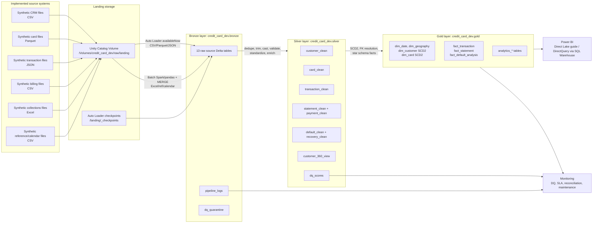
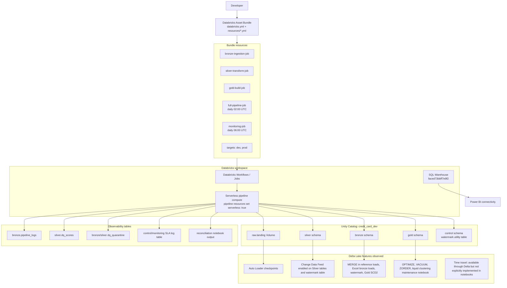
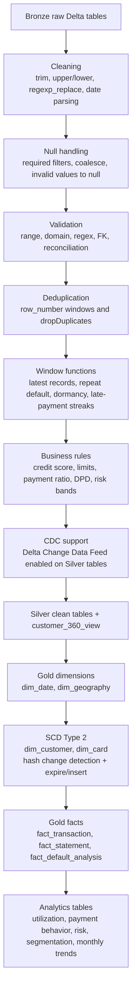
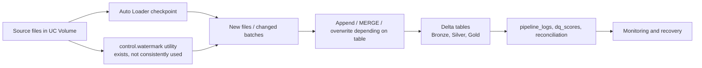
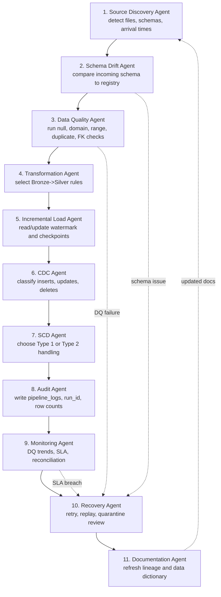

# Complete Architecture Documentation

Project: Credit Card Defaulter Analysis  
Current platform in repository: Databricks on AWS, PySpark, Spark SQL, Delta Lake, Unity Catalog, Databricks Asset Bundles, Databricks Workflows, Power BI connectivity guidance.

## Repository Analysis Summary

The project implements a medallion lakehouse for credit card default analytics.

Current folders inspected:

| Area | Actual path | Purpose |
|---|---|---|
| Utilities | `notebooks/00_utilities` | Central config, DQ framework, logger, watermark utility, schema registry, DQ table initialization |
| Bronze ingestion | `notebooks/01_ingestion`, `notebooks/02_bronze` | Auto Loader and batch ingestion into raw Delta tables, bronze validation |
| Silver transforms | `notebooks/03_silver` | Cleaning, validation, standardization, deduplication, enrichment, customer 360, DQ scoring |
| Gold transforms | `notebooks/04_gold` | SCD2 dimensions, star schema facts, FK/SCD validation |
| Analytics | `notebooks/05_analytics` | Credit utilization, payment behavior, default risk scoring, monthly trends, customer segmentation |
| Monitoring | `notebooks/06_monitoring` | DQ monitoring, SLA checks, reconciliation, maintenance, Power BI guide, SQL alerts |
| Bundle resources | `resources/*.yml`, `databricks.yml` | Databricks Asset Bundle jobs, pipelines, schedules, dev/prod targets |
| Schemas/config | `schemas/*.py`, `config/*.json` | Table schemas, business rules, pipeline configuration |
| Tests | `tests/unit/test_transformations.py` | Local PySpark unit tests for transformation patterns |
| Data generator | `data_generator/*.py` | Synthetic source file generation and upload to UC Volume |

Folders requested but not present as top-level folders: `bronze/`, `silver/`, `gold/`, `common/`, `utils/`, `pipelines/`. Their responsibilities are implemented through notebook folders, `resources`, `schemas`, and `config`.

## Current Source Systems

The repository does not implement PostgreSQL, SQL Server, CRM API, or ERP connectors. It implements synthetic banking source files generated by Python scripts and uploaded to a Unity Catalog Volume.

| Source domain | Implemented source | Format | Landing path pattern |
|---|---|---|---|
| CRM customer | Synthetic generator `generate_crm.py` | CSV | `/Volumes/credit_card_dev/raw/landing/crm/customer_master` |
| CRM address | Synthetic generator `generate_crm.py` | CSV | `/Volumes/credit_card_dev/raw/landing/crm/customer_address` |
| Card details | Synthetic generator `generate_card.py` | Parquet | `/Volumes/credit_card_dev/raw/landing/card/card_details` |
| Card status | Synthetic generator `generate_card.py` | Parquet | `/Volumes/credit_card_dev/raw/landing/card/card_status` |
| Transactions | Synthetic generator `generate_transactions.py` | JSON | `/Volumes/credit_card_dev/raw/landing/txn/transactions` |
| Billing statements | Synthetic generator `generate_billing.py` | CSV | `/Volumes/credit_card_dev/raw/landing/billing/billing_statements` |
| Billing payments | Synthetic generator `generate_billing.py` | CSV | `/Volumes/credit_card_dev/raw/landing/billing/billing_payments` |
| Collections defaults | Synthetic generator `generate_collections.py` | Excel | `/Volumes/credit_card_dev/raw/landing/collections/collections_defaults` |
| Collections recovery | Synthetic generator `generate_collections.py` | Excel | `/Volumes/credit_card_dev/raw/landing/collections/collections_recovery` |
| Reference/calendar | Synthetic generator `generate_reference_calendar.py` | CSV | `/Volumes/credit_card_dev/raw/landing/ref/...` |

ADLS Gen2 is mentioned in the requested target stack, but the repository uses Unity Catalog Volume paths (`/Volumes/...`) and does not contain `abfss://` external location configuration. Treat ADLS Gen2 as a production extension, not a current implementation.

## High-Level Architecture Diagram

## Detailed Databricks Architecture Diagram

## Transformation Flow Diagram

## Incremental Load Assessment

Implemented:

| Capability | Evidence |
|---|---|
| Auto Loader checkpointing | Bronze CSV/Parquet/JSON notebooks use `readStream.format("cloudFiles")`, `checkpointLocation`, and `trigger(availableNow=True)` |
| Schema evolution rescue | Bronze Auto Loader uses `cloudFiles.schemaEvolutionMode = rescue`; runner uses explicit schemas and rescue mode |
| Batch MERGE | Reference tables and Excel collections use Delta MERGE patterns |
| Watermark utility | `notebooks/00_utilities/watermark.py` creates `credit_card_dev.control.watermark` and uses MERGE to update high-water marks |
| Silver CDF | Silver notebooks set `delta.enableChangeDataFeed = true` |
| Gold SCD2 | `gold_dim_customer.py` and `gold_dim_card.py` expire current rows and append new versions |
| Idempotent-style loads | Bronze Auto Loader checkpoints and many Silver/Gold overwrite builds make reruns deterministic for current snapshots |

Missing or partial:

| Gap | Current state |
|---|---|
| Watermark used by pipelines | The utility exists, but production notebooks generally do not call `Watermark.get()`/`update()` for filtering |
| True CDC ingestion from databases | No PostgreSQL/SQL Server/API CDC connector is implemented |
| Delete handling | CDF is enabled, but downstream notebooks do not consume `_change_type` or implement delete propagation |
| Replay by business timestamp | Checkpoint reset exists in `bronze_ingestion_runner.py`, but governed replay parameters are not implemented |
| SCD Type 1 | Not explicitly implemented as a reusable pattern; non-SCD tables are mostly overwrite snapshots or MERGE reference tables |
| CI/CD | DAB commands and dev/prod targets exist, but no `.github/workflows` pipeline exists in the repo |
| ADLS Gen2 external locations | Not found; only UC Volume paths are implemented |

## Incremental Load Diagram

## Agentic Workflow Design

These agents are a proposed operating model on top of the project; they are not implemented as executable agents in the repo.

## CI/CD Architecture Diagram

Current state: DAB resources and tests exist, but no GitHub Actions workflow file was found.

Target production design:

```mermaid
flowchart LR
    DEV["Developer"] --> GH["GitHub repository"]
    GH --> GHA["GitHub Actions<br/>target recommendation"]
    GHA --> TEST["Unit tests<br/>pytest tests/unit"]
    TEST --> LINT["Lint + bundle validate"]
    LINT --> DAB["Databricks Asset Bundle"]
    DAB --> DEVENV["Deploy to dev"]
    DEVENV --> QA["Promote to QA/staging<br/>recommended target"]
    QA --> PROD["Deploy to prod"]
    PROD --> MON["Post-deploy smoke tests<br/>DQ + reconciliation"]
```

Recommended workflow stages:

1. Pull request: run `pytest`, lint, static SQL checks, and `databricks bundle validate -t dev`.
2. Merge to main: deploy to dev and run a small smoke job.
3. Release tag: deploy to QA/staging, run integration tests.
4. Manual approval: deploy to prod and run monitoring checks.

## Production Readiness Assessment

| Category | Score / 10 | Reason |
|---|---:|---|
| Architecture | 8 | Clear medallion structure, DAB resources, Unity Catalog, Delta tables, star schema |
| Scalability | 7 | Auto Loader and Delta used; current synthetic sources and overwrite patterns limit enterprise scale |
| Reliability | 7 | Jobs have dependencies/retries; not all notebooks have robust retry/replay behavior |
| Performance | 7 | Broadcast joins, optimizeWrite, maintenance notebook; some overwrite builds and one cache usage remain |
| Cost optimization | 6 | Serverless pipelines are configured; no cost guardrails in deployed workflow |
| Observability | 7 | Pipeline logs, DQ scores, SLA and reconciliation notebooks exist |
| Recoverability | 6 | Checkpoints, quarantine, and logs exist; formal replay/backfill workflow is incomplete |
| Maintainability | 7 | Central config and schemas exist; notebook code would benefit from packaged reusable modules |
| Security | 5 | Unity Catalog is used; no grants, secrets policy, masking, or service principal CI found in repo |
| Interview readiness | 9 | Strong project story, diagrams, business use case, and real Databricks patterns |

## Production Recommendations

1. Add a real `.github/workflows/databricks.yml` pipeline for tests, bundle validation, deploy, and promotion gates.
2. Add explicit QA/staging target in `databricks.yml`; current targets are dev and prod.
3. Replace snapshot overwrites with consistent MERGE or CDC-aware upserts where required.
4. Wire `Watermark` into actual notebooks and store per-table high-water marks after successful loads.
5. Add delete handling using Delta Change Data Feed if source systems can emit deletes.
6. Add ADLS Gen2 external locations, storage credentials, and UC grants if the platform must be enterprise Azure-native.
7. Remove `.cache()` usage from `silver_enrichment.py` or guard it for serverless compatibility.
8. Define Unity Catalog grants, table ownership, PII tags, masking policies, and RLS strategy.
9. Add deployment smoke tests against Databricks SQL Warehouse after each bundle deploy.
10. Add data contracts for each source and schema drift alerting.
11. Promote common functions from notebooks into a tested Python package or wheel.
12. Add observability dashboards for `pipeline_logs`, `dq_scores`, SLA log, and reconciliation results.

