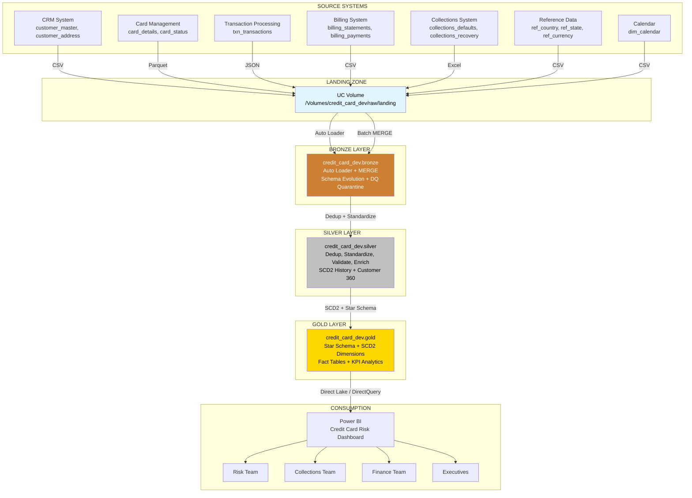
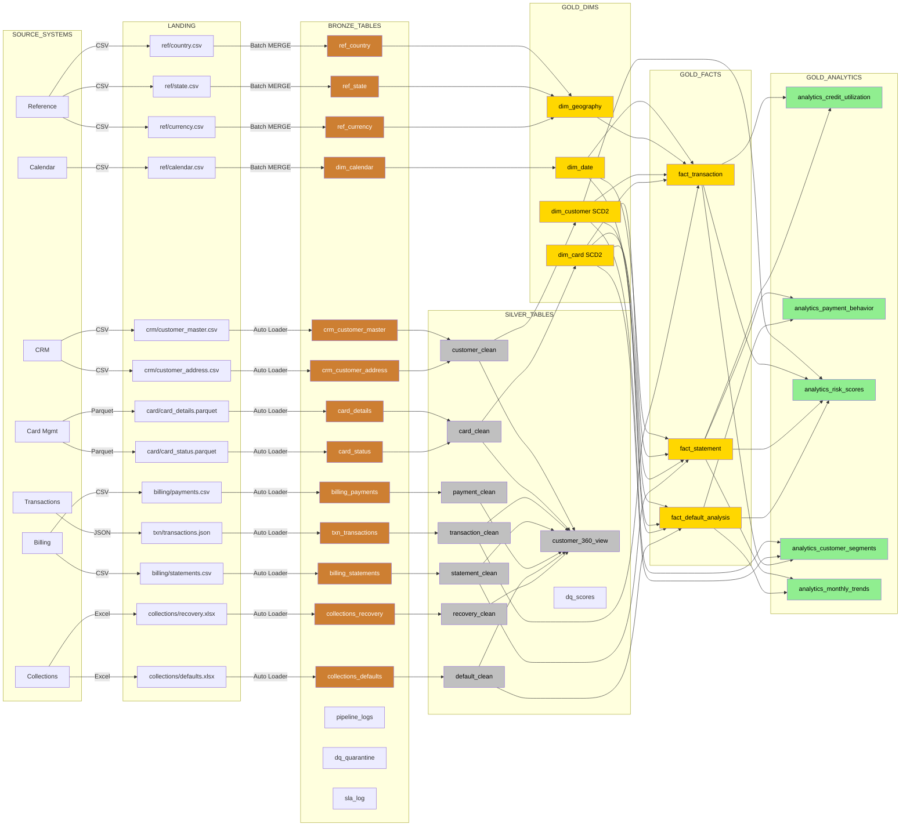
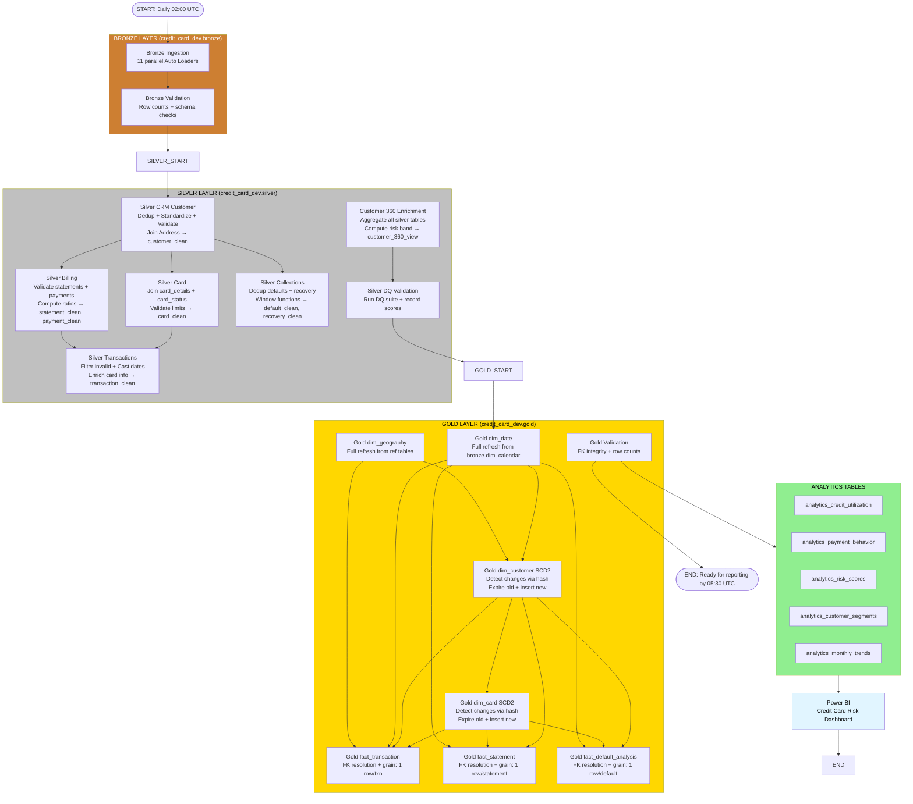
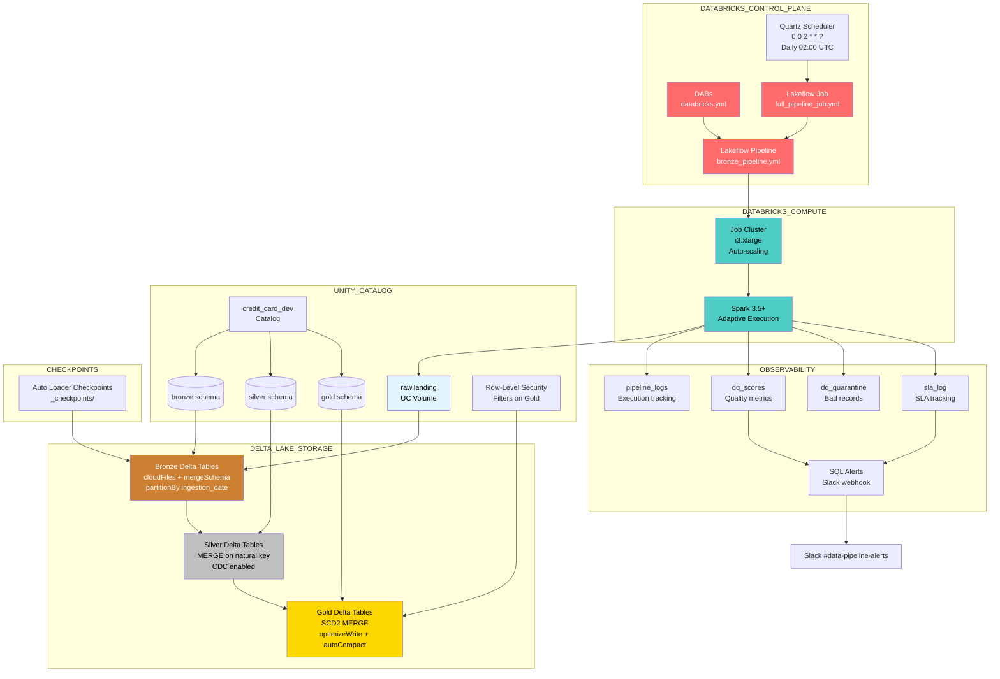
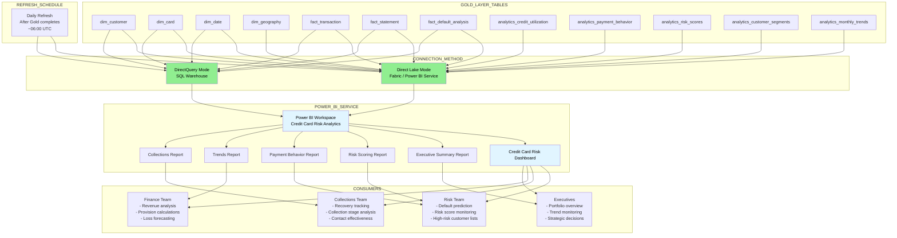

# Architecture Diagrams — Credit Card Defaulter Analysis

**Catalog:** `credit_card_dev`  
**Project:** Credit Card Defaulter End-to-End Analysis  
**Tech Stack:** Databricks + PySpark + Delta Lake + Medallion Architecture + Power BI  
**Last Updated:** 2026-06-06

---

## Table of Contents

1. [High-Level Architecture Diagram](#1-high-level-architecture-diagram)
2. [Low-Level Detailed Data Flow Diagram](#2-low-level-detailed-data-flow-diagram)
3. [Source-to-Target Mapping Diagram](#3-source-to-target-mapping-diagram)
4. [Fact and Dimension Star Schema Diagram](#4-fact-and-dimension-star-schema-diagram)
5. [ETL Workflow Diagram (Bronze → Silver → Gold)](#5-etl-workflow-diagram-bronze--silver--gold)
6. [Delta Lake and Databricks Workflow Diagram](#6-delta-lake-and-databricks-workflow-diagram)
7. [Power BI Reporting Architecture](#7-power-bi-reporting-architecture)

---

## 1. High-Level Architecture Diagram



### Layer-by-Layer Explanation

#### LANDING ZONE (UC Volume)
- **What data flows through:** Raw files from all source systems in their native formats (CSV, Parquet, JSON, Excel)
- **Source systems:** CRM, Card Management, Transaction Processing, Billing, Collections, Reference Data, Calendar
- **Why it exists:** Decouples source systems from the data platform. Provides a persistent, immutable staging area for raw files before processing.
- **Consumers:** Bronze ingestion pipelines only

#### BRONZE LAYER
- **What data flows through:** Raw ingested data with added metadata columns (ingestion_date, ingestion_batch_id, source_file, load_timestamp, _created_at, _created_by)
- **Source systems:** All 7 source systems via Landing Zone
- **Major transformations:** Schema enforcement, metadata enrichment, rescued data column for schema mismatches, DQ quarantine
- **Tables created:** 13 tables (crm_customer_master, crm_customer_address, card_details, card_status, txn_transactions, billing_statements, billing_payments, collections_defaults, collections_recovery, ref_country, ref_state, ref_currency, dim_calendar)
- **Dependencies:** Landing Zone must have source files
- **Business questions solved:** "Do we have all source data?", "When was data last loaded?", "Are there schema changes in source systems?"
- **KPIs produced:** Row counts per table, ingestion timestamps, DQ quarantine counts
- **Consumers:** Data Engineering team, Silver layer pipelines
- **Why it exists:** Provides audit trail, schema evolution handling, and a single source of truth for raw data. Enables reprocessing without re-fetching from sources.

#### SILVER LAYER
- **What data flows through:** Cleansed, deduplicated, standardized, and validated data with surrogate keys
- **Source systems:** Derived from Bronze layer tables
- **Major transformations:** Deduplication (keep latest), standardization (gender, marital_status, employment_status), validation (email regex, DOB past dates, credit_score 300-850, income > 0), enrichment (join address to customer), computed fields (payment_due_flag, days_to_due, utilization_ratio, payment_ratio)
- **Tables created:** 8 tables (customer_clean, card_clean, transaction_clean, statement_clean, payment_clean, default_clean, recovery_clean, customer_360_view)
- **Dependencies:** Bronze tables must be populated; customer_clean must exist before card_clean; card_clean before transaction_clean; all before customer_360_view
- **Business questions solved:** "Who are our customers with valid contact info?", "What is the credit quality of our card portfolio?", "Are transactions valid and complete?", "Which statements are overdue?"
- **KPIs produced:** DQ scores (0-100), null percentages, duplicate counts, validation pass rates, utilization ratios, payment ratios
- **Consumers:** Gold layer, Risk Team, Data Quality team
- **Why it exists:** Single version of truth for cleansed data. Enables accurate analytics by eliminating duplicates, fixing formats, and validating business rules.

#### GOLD LAYER
- **What data flows through:** Dimensional model with SCD2 dimensions and conformed fact tables, plus aggregated analytics tables
- **Source systems:** Derived from Silver layer
- **Major transformations:** SCD Type 2 on dim_customer and dim_card, foreign key resolution to dimensions, aggregation into analytics tables (credit_utilization, payment_behavior, risk_scores, customer_segments, monthly_trends)
- **Tables created:** 4 dimensions (dim_date, dim_geography, dim_customer, dim_card) + 3 facts (fact_transaction, fact_statement, fact_default_analysis) + 5 analytics tables
- **Dependencies:** Silver tables must be populated; dim_geography before dim_customer; dim_customer before dim_card; all dimensions before facts
- **Business questions solved:** "Which customers are likely to default?", "Who are high-risk customers?", "What is the customer credit utilization ratio?", "Which regions have the highest default rates?", "What are the spending patterns of customers?", "Which customers are consistently making late payments?", "How effective are collection and recovery efforts?"
- **KPIs produced:** Risk scores (0-100), risk tiers, delinquency scores, utilization ratios, default rates, recovery rates, RFM segments, MoM spend growth, 3-month rolling averages
- **Consumers:** Power BI, Risk Team, Collections Team, Finance Team, Executives
- **Why it exists:** Provides optimized, business-ready data model for reporting and analytics. SCD2 enables historical analysis. Star schema enables fast, intuitive queries.

---

## 2. Low-Level Detailed Data Flow Diagram



---

## 3. Source-to-Target Mapping Diagram

```mermaid
graph LR
    subgraph "SOURCE_FIELDS"
        SC1["customer_id"]
        SC2["first_name"]
        SC3["last_name"]
        SC4["date_of_birth"]
        SC5["gender"]
        SC6["marital_status"]
        SC7["email"]
        SC8["phone_number"]
        SC9["employment_status"]
        SC10["annual_income"]
        SC11["credit_score"]
        SC12["city"]
        SC13["state_code"]
        SC14["country_code"]
        SC15["card_id"]
        SC16["customer_id"]
        SC17["card_type"]
        SC18["card_network"]
        SC19["issued_date"]
        SC20["expiry_date"]
        SC21["credit_limit"]
        SC22["cash_limit"]
        SC23["interest_rate"]
        SC24["status_code"]
        SC25["transaction_id"]
        SC26["transaction_date"]
        SC27["transaction_time"]
        SC28["merchant_name"]
        SC29["merchant_category"]
        SC30["amount"]
        SC31["statement_id"]
        SC32["due_date"]
        SC33["opening_balance"]
        SC34["total_purchases"]
        SC35["total_payments"]
        SC36["closing_balance"]
        SC37["minimum_due"]
        SC38["default_id"]
        SC39["days_past_due"]
        SC40["outstanding_amount"]
        SC41["recovery_amount"]
    end

    subgraph "BRONZE"
        B1["crm_customer_master"]
        B2["crm_customer_address"]
        B3["card_details"]
        B4["card_status"]
        B5["txn_transactions"]
        B6["billing_statements"]
        B7["billing_payments"]
        B8["collections_defaults"]
        B9["collections_recovery"]
    end

    subgraph "SILVER"
        S1["customer_clean"]
        S2["card_clean"]
        S3["transaction_clean"]
        S4["statement_clean"]
        S5["payment_clean"]
        S6["default_clean"]
        S7["recovery_clean"]
    end

    subgraph "GOLD"
        D1["dim_customer"]
        D2["dim_card"]
        D3["dim_date"]
        D4["dim_geography"]
        F1["fact_transaction"]
        F2["fact_statement"]
        F3["fact_default_analysis"]
    end

    SC1 --> B1
    SC2 --> B1
    SC3 --> B1
    SC4 --> B1
    SC5 --> B1
    SC6 --> B1
    SC7 --> B1
    SC8 --> B1
    SC9 --> B1
    SC10 --> B1
    SC11 --> B1

    SC1 --> B2
    SC12 --> B2
    SC13 --> B2
    SC14 --> B2

    SC15 --> B3
    SC16 --> B3
    SC17 --> B3
    SC18 --> B3
    SC19 --> B3
    SC20 --> B3
    SC21 --> B3
    SC22 --> B3
    SC23 --> B3

    SC15 --> B4
    SC24 --> B4

    SC25 --> B5
    SC15 --> B5
    SC26 --> B5
    SC27 --> B5
    SC28 --> B5
    SC29 --> B5
    SC30 --> B5

    SC31 --> B6
    SC15 --> B6
    SC32 --> B6
    SC33 --> B6
    SC34 --> B6
    SC35 --> B6
    SC36 --> B6
    SC37 --> B6

    SC38 --> B8
    SC16 --> B8
    SC15 --> B8
    SC39 --> B8
    SC40 --> B8

    SC41 --> B9

    B1 --> S1
    B2 --> S1
    B3 --> S2
    B4 --> S2
    B5 --> S3
    B6 --> S4
    B7 --> S5
    B8 --> S6
    B9 --> S7

    S1 --> D1
    S2 --> D2
    S3 --> F1
    S4 --> F2
    S6 --> F3

    D1 --> F1
    D2 --> F1
    D3 --> F1
    D4 --> F1

    D1 --> F2
    D2 --> F2
    D3 --> F2

    D1 --> F3
    D2 --> F3
    D3 --> F3

    style B1 fill:#cd7f32,color:#fff
    style B2 fill:#cd7f32,color:#fff
    style B3 fill:#cd7f32,color:#fff
    style B4 fill:#cd7f32,color:#fff
    style B5 fill:#cd7f32,color:#fff
    style B6 fill:#cd7f32,color:#fff
    style B7 fill:#cd7f32,color:#fff
    style B8 fill:#cd7f32,color:#fff
    style B9 fill:#cd7f32,color:#fff
    style S1 fill:#c0c0c0,color:#000
    style S2 fill:#c0c0c0,color:#000
    style S3 fill:#c0c0c0,color:#000
    style S4 fill:#c0c0c0,color:#000
    style S5 fill:#c0c0c0,color:#000
    style S6 fill:#c0c0c0,color:#000
    style S7 fill:#c0c0c0,color:#000
    style D1 fill:#ffd700,color:#000
    style D2 fill:#ffd700,color:#000
    style D3 fill:#ffd700,color:#000
    style D4 fill:#ffd700,color:#000
    style F1 fill:#ffd700,color:#000
    style F2 fill:#ffd700,color:#000
    style F3 fill:#ffd700,color:#000
```



---

## 4. Fact and Dimension Star Schema Diagram

```mermaid
erDiagram
    dim_customer ||--o{ fact_transaction : "has"
    dim_customer ||--o{ fact_statement : "has"
    dim_customer ||--o{ fact_default_analysis : "has"
    dim_card ||--o{ fact_transaction : "used_for"
    dim_card ||--o{ fact_statement : "billed_on"
    dim_card ||--o{ fact_default_analysis : "defaulted_on"
    dim_date ||--o{ fact_transaction : "occurred_on"
    dim_date ||--o{ fact_statement : "statement_date"
    dim_date ||--o{ fact_default_analysis : "default_date"
    dim_geography ||--o{ fact_transaction : "merchant_location"

    dim_customer {
        bigint customer_sk PK "Surrogate key (SCD2)"
        string customer_id NK "Natural key"
        string full_name
        date date_of_birth
        int age
        string gender
        string marital_status
        string email
        string phone_number
        string employment_status
        decimal annual_income
        int credit_score
        string city
        string state_code
        string country_code
        bigint geo_sk FK
        date effective_date "SCD2 start"
        date expiry_date "SCD2 end (9999-12-31=current)"
        boolean is_current
        string scd_hash
        timestamp _created_at
        timestamp _modified_at
    }

    dim_card {
        bigint card_sk PK "Surrogate key (SCD2)"
        string card_id NK "Natural key"
        bigint customer_sk FK
        string card_type
        string card_network
        date issued_date
        date expiry_date
        decimal credit_limit
        decimal cash_limit
        decimal interest_rate
        string current_status
        date effective_date "SCD2 start"
        date expiry_date "SCD2 end"
        boolean is_current
        string scd_hash
    }

    dim_date {
        int date_sk PK "YYYYMMDD"
        date full_date
        int day_of_week
        string day_name
        int day_of_month
        int day_of_year
        int week_of_year
        int month_number
        string month_name
        int quarter
        int year
        boolean is_weekend
        boolean is_holiday
        int fiscal_year
        int fiscal_quarter
    }

    dim_geography {
        bigint geo_sk PK
        string country_code
        string country_name
        string country_region
        string state_code
        string state_name
        string region
        string currency_code
    }

    fact_transaction {
        bigint txn_sk PK
        string transaction_id NK
        bigint customer_sk FK
        bigint card_sk FK
        int date_sk FK
        bigint geo_sk FK
        timestamp transaction_datetime
        decimal amount
        string currency_code
        string merchant_name
        string merchant_category_code
        string merchant_category_desc
        string transaction_type
        string pos_entry_mode
    }

    fact_statement {
        bigint statement_sk PK
        string statement_id NK
        bigint customer_sk FK
        bigint card_sk FK
        int statement_date_sk FK
        int due_date_sk FK
        decimal opening_balance
        decimal total_purchases
        decimal total_payments
        decimal total_credits
        decimal interest_charged
        decimal fees_charged
        decimal closing_balance
        decimal minimum_due
        boolean payment_due_flag
        int days_to_due
    }

    fact_default_analysis {
        bigint default_sk PK
        string default_id NK
        bigint customer_sk FK
        bigint card_sk FK
        int default_date_sk FK
        int days_past_due
        decimal outstanding_amount
        string collection_stage
        boolean is_repeat_default
        int dormancy_period_days
        decimal recovery_amount
        int recovery_count
        string recovery_status
        decimal recovery_rate_pct
    }
```

### Star Schema Explanation

#### Dimensions

**dim_customer (SCD Type 2)**
- **Grain:** 1 row per customer per version
- **Business purpose:** Track customer attribute changes over time (credit score changes, income changes, address changes)
- **SCD2 tracked columns:** credit_score, annual_income, employment_status, marital_status, city, state_code, country_code
- **Business questions answered:** "What was the customer's credit score when they defaulted?", "How has customer risk profile evolved?"
- **Consumers:** Risk Team, Analytics, Power BI

**dim_card (SCD Type 2)**
- **Grain:** 1 row per card per version
- **Business purpose:** Track card attribute changes (credit limit changes, status changes, interest rate changes)
- **SCD2 tracked columns:** credit_limit, cash_limit, interest_rate, current_status
- **Business questions answered:** "What was the credit limit at time of default?", "How many times has this card been blocked?"
- **Consumers:** Risk Team, Collections Team

**dim_date**
- **Grain:** 1 row per day
- **Business purpose:** Enable time-based analysis, fiscal year calculations, holiday analysis
- **Business questions answered:** "What is the default rate by quarter?", "Are defaults more common on weekends?"
- **Consumers:** All teams, Executives

**dim_geography**
- **Grain:** 1 row per country/state combination
- **Business purpose:** Geographic analysis of defaults and spending
- **Business questions answered:** "Which states have the highest default rates?", "Which countries have the highest spending?"
- **Consumers:** Risk Team, Finance Team, Executives

#### Facts

**fact_transaction**
- **Grain:** 1 row per credit card transaction
- **Measures:** amount
- **Business purpose:** Analyze spending patterns, merchant categories, transaction types
- **Business questions answered:** "What are the spending patterns of customers?", "Which merchants are most used by high-risk customers?", "What is the average transaction amount by card type?"
- **Consumers:** Risk Team, Finance Team, Marketing

**fact_statement**
- **Grain:** 1 row per card per billing cycle
- **Measures:** opening_balance, total_purchases, total_payments, total_credits, interest_charged, fees_charged, closing_balance, minimum_due
- **Derived:** payment_due_flag, days_to_due
- **Business purpose:** Analyze payment behavior, billing patterns, credit utilization
- **Business questions answered:** "Which customers are consistently making late payments?", "What is the average days_to_due?", "How many customers are paying only the minimum?"
- **Consumers:** Risk Team, Collections Team, Finance Team

**fact_default_analysis**
- **Grain:** 1 row per default event
- **Measures:** days_past_due, outstanding_amount, recovery_amount, recovery_count
- **Derived:** recovery_rate_pct
- **Business purpose:** Analyze default patterns, collection effectiveness, recovery rates
- **Business questions answered:** "How effective are collection and recovery efforts?", "What is the average DPD at default?", "What percentage of defaults are repeat defaults?"
- **Consumers:** Collections Team, Risk Team, Finance Team

---

## 5. ETL Workflow Diagram (Bronze → Silver → Gold)



### ETL Workflow Explanation

#### Bronze Phase (~45 minutes)
1. **Parallel Ingestion:** 11 Auto Loader streams run in parallel (CRM, Card, Transactions, Billing, Collections, Reference)
2. **Bronze Validation:** Row counts, schema checks, rescued data review
3. **Output:** 13 raw Delta tables with metadata columns

#### Silver Phase (~30 minutes)
1. **Silver CRM Customer:** Dedup customer records (keep latest by load_timestamp), standardize codes (M/F/O → MALE/FEMALE/OTHER), validate email regex, DOB past dates, credit_score 300-850, join latest HOME address
2. **Silver Card:** Join card_details + card_status, validate credit_limit > 0, cash_limit ≤ credit_limit, interest_rate 0-50%
3. **Silver Transactions:** Filter invalid amounts, cast dates, combine date+time to timestamp, enrich with card_type and card_network
4. **Silver Billing:** Validate statement balances, compute payment_due_flag, days_to_due, utilization_ratio, payment_ratio
5. **Silver Collections:** Dedup defaults, window functions for is_repeat_default, dormancy_period_days, dpd_trend
6. **Customer 360:** Aggregate all silver tables into single customer view with risk_band
7. **Silver DQ:** Run DQ suite, record scores, quarantine bad records

#### Gold Phase (~20 minutes)
1. **dim_date & dim_geography:** Full refresh from reference data
2. **dim_customer (SCD2):** Hash-based change detection on tracked columns, expire old versions, insert new versions
3. **dim_card (SCD2):** Same SCD2 logic for card attributes
4. **Fact tables:** Resolve FKs to dimensions, populate measures
5. **Gold Validation:** FK integrity checks, row count reconciliation

#### Analytics Phase (~15 minutes)
- Compute credit_utilization, payment_behavior, risk_scores, customer_segments, monthly_trends

---

## 6. Delta Lake and Databricks Workflow Diagram



### Databricks & Delta Lake Features Used

#### Databricks Features
| Feature | Usage |
|---------|-------|
| Unity Catalog | Centralized metadata, governance, volume storage |
| UC Volumes | Raw landing zone for source files |
| Auto Loader | Incremental file ingestion with schema evolution |
| Lakeflow Pipelines | Declarative pipeline definitions |
| Lakeflow Jobs | Orchestrated pipeline execution |
| DABs (Databricks Asset Bundles) | Infrastructure-as-code for pipelines/jobs |
| Quartz Scheduler | Cron-based scheduling (02:00 UTC daily) |
| SQL Alerts | Threshold-based alerting on DQ scores |
| Slack Webhook | Alert notifications |
| Row-Level Security | Data access control on Gold tables |
| SQL Warehouse | Power BI connection endpoint |

#### Delta Lake Features
| Feature | Layer | Purpose |
|---------|-------|---------|
| `mergeSchema` | Bronze | Handle schema evolution from sources |
| `rescuedData` column | Bronze | Capture unexpected columns/type mismatches |
| `partitionBy` | Bronze | Partition by ingestion_date for efficient pruning |
| `CDC (Change Data Feed)` | Silver | Track changes for downstream consumers |
| `MERGE` (upsert) | Silver/Gold | Incremental updates without full rewrite |
| `SCD Type 2` | Gold | Historical tracking of dimension changes |
| `optimizeWrite` | Gold | Coalesce small files during write |
| `autoCompact` | Gold | Automatically compact small files |
| `ZORDER` | Gold (optional) | Optimize for frequent filter columns |
| `liquidClustering` | Gold | Auto-clustering on high-cardinality columns |
| `timeTravel` | All | Query historical versions for debugging |
| `Vacuum` | All | Clean up old files per retention policy |

---

## 7. Power BI Reporting Architecture



### Power BI Report Specifications

#### Connection Configuration
- **Mode:** Direct Lake (preferred) or DirectQuery via SQL Warehouse
- **Warehouse:** `faced73bbff7e9f2` (SQL Warehouse ID from databricks.yml)
- **Refresh:** Daily after Gold completes (~06:00 UTC)
- **Authentication:** Service Principal or OAuth

#### Report Pages

**1. Executive Summary**
- KPIs: Total customers, total cards, total outstanding, default rate, recovery rate
- Visualizations: KPI cards, default rate trend, portfolio composition
- **Consumers:** Executives, Finance Team
- **Business questions:** "What is the current portfolio health?", "How is default trending?"

**2. Risk Scoring Dashboard**
- KPIs: Risk score distribution, risk tier breakdown, high-risk customer count
- Visualizations: Risk score histogram, customer segmentation matrix, top risk drivers
- **Consumers:** Risk Team
- **Business questions:** "Which customers are likely to default?", "Who are high-risk customers?", "What is driving risk scores?"

**3. Payment Behavior Analysis**
- KPIs: Payment ratio, delinquency score, late payment %, consecutive late months
- Visualizations: Payment pattern timeline, delinquency trend, minimum vs full payment ratio
- **Consumers:** Risk Team, Collections Team
- **Business questions:** "Which customers are consistently making late payments?", "What is the average payment ratio?"

**4. Credit Utilization Monitor**
- KPIs: Utilization ratio, over-limit count, utilization risk flag count
- Visualizations: Utilization distribution, over-limit customers list, utilization by card type
- **Consumers:** Risk Team, Finance Team
- **Business questions:** "What is the customer credit utilization ratio?", "Who is over their credit limit?"

**5. Geographic Analysis**
- KPIs: Default rate by state/region, average credit score by geography, spend by country
- Visualizations: Choropleth map, regional comparison table
- **Consumers:** Risk Team, Executives
- **Business questions:** "Which regions have the highest default rates?", "Where is our highest-spending customer base?"

**6. Collections & Recovery**
- KPIs: Recovery rate, collection stage distribution, DPD at default, time to recovery
- Visualizations: Recovery funnel, collection effectiveness trend, outstanding vs recovered
- **Consumers:** Collections Team, Finance Team
- **Business questions:** "How effective are collection and recovery efforts?", "What is the recovery rate by collection stage?"

**7. Customer 360 Detail**
- KPIs: RFM score, combined segment, customer lifetime value
- Visualizations: Customer detail table with drill-through, segment distribution
- **Consumers:** All teams
- **Business questions:** "What are the spending patterns of customers?", "Who are our most valuable customers?"

---

## Appendix: Business Question to Data Mapping

| Business Question | Source Tables | Gold Tables | KPI/Metric |
|------------------|---------------|-------------|------------|
| Which customers are likely to default? | collections_defaults, billing_statements, txn_transactions | fact_default_analysis, analytics_risk_scores | risk_score, risk_tier, default_probability |
| Who are high-risk customers? | All sources | analytics_risk_scores, dim_customer | risk_score >= 7, risk_tier = HIGH/VERY_HIGH |
| What is the customer credit utilization ratio? | billing_statements, card_details | analytics_credit_utilization, fact_statement | utilization_ratio, utilization_bucket |
| Which regions have the highest default rates? | collections_defaults, crm_customer_address | fact_default_analysis, dim_geography | default_rate_pct, region |
| What are the spending patterns of customers? | txn_transactions | fact_transaction, analytics_customer_segments | RFM_score, total_spend, avg_txn_amount |
| Which customers are consistently making late payments? | billing_statements, billing_payments | analytics_payment_behavior, fact_statement | delinquency_score, late_payment_pct, max_consecutive_late_months |
| How effective are collection and recovery efforts? | collections_defaults, collections_recovery | fact_default_analysis | recovery_rate_pct, recovery_status |
| What is the monthly default rate trend? | collections_defaults, billing_statements | analytics_monthly_trends | default_rate_pct, spend_mom_pct |
| Who are repeat defaulters? | collections_defaults | fact_default_analysis | is_repeat_default, default_sequence |
| What is the average DPD at default declaration? | collections_defaults | fact_default_analysis | days_past_due, dpd_trend |

---

## Appendix: KPI Definitions Reference

| KPI | Formula | Source Table | Thresholds |
|-----|---------|--------------|------------|
| Credit Utilization Ratio | closing_balance / credit_limit | analytics_credit_utilization | LOW: 0-30%, MODERATE: 30-70%, HIGH: 70-90%, CRITICAL: 90-100% |
| Payment Ratio | total_payments / closing_balance | fact_statement | 1.0 = full payment, <0.05 = delinquency risk |
| Risk Score | Weighted composite 0-100 | analytics_risk_scores | VERY_LOW <15, LOW 15-35, MEDIUM 35-55, HIGH 55-75, VERY_HIGH ≥75 |
| Delinquency Score | Weighted composite 0-100 | analytics_payment_behavior | LOW_RISK 0-30, MODERATE_RISK 30-60, HIGH_RISK ≥60 |
| Default Rate | defaulted_customers / active_customers × 100 | analytics_monthly_trends | Industry benchmark: 1-3% |
| Recovery Rate | recovery_amount / outstanding_amount × 100 | fact_default_analysis | >60% = strong, <20% = write-off candidate |
| Days Past Due (DPD) | datediff(current_date, due_date) WHERE payment < minimum_due | fact_default_analysis | 1-30: Early, 31-60: Mid, 61-90: Late, 90+: Charge-off |
| RFM Score | r_score + f_score + m_score (3-15) | analytics_customer_segments | CHAMPIONS ≥12, AT_RISK ≤6 |
| MoM Spend Growth | (current - prior) / prior × 100 | analytics_monthly_trends | Positive = growth, Negative = decline |
| 3-Month Rolling Avg | AVG(total_spend) OVER 3 months | analytics_monthly_trends | Smoothed trend indicator |

---

## Appendix: Consumer Matrix

| Consumer | Primary Reports | Key KPIs | Refresh Frequency |
|----------|----------------|----------|-------------------|
| Risk Team | Risk Scoring, Payment Behavior, Utilization | risk_score, delinquency_score, utilization_ratio, late_payment_pct | Daily |
| Collections Team | Collections & Recovery, Default Analysis | recovery_rate_pct, collection_stage, days_past_due, dpd_trend | Daily |
| Finance Team | Executive Summary, Trends, Revenue | default_rate_pct, total_outstanding, provision_calculations, MoM trends | Daily |
| Executives | Executive Summary, Geographic Analysis | portfolio_health, default_rate_trend, regional_performance | Daily |
| Data Engineering | Pipeline Monitoring, DQ Reports | dq_score, row_counts, sla_status, ingestion_timestamps | Real-time/On-demand |

---

*End of Architecture Diagrams Document*
