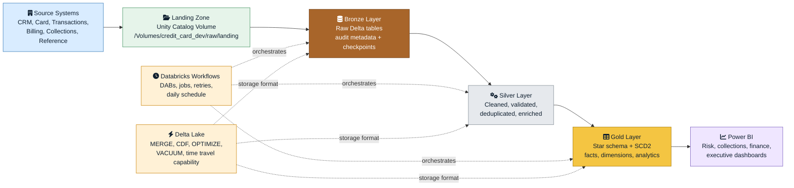
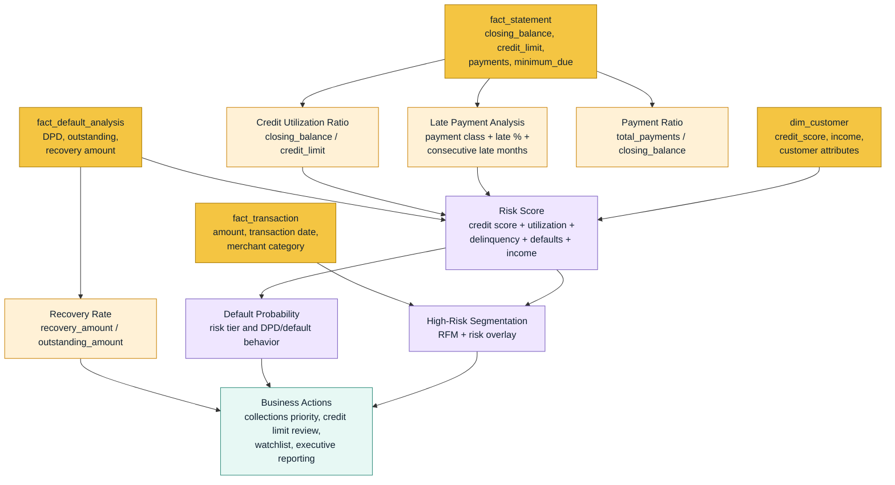
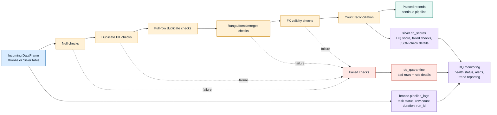
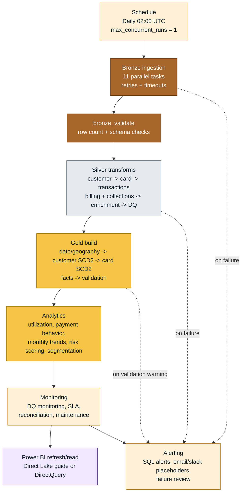
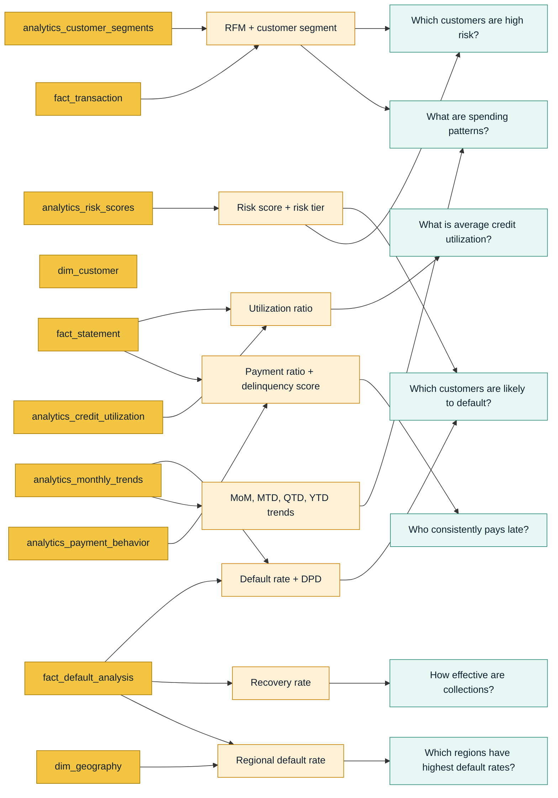

```mermaid
flowchart TB
    classDef src fill:#d9ecff,stroke:#2f75b5,color:#102030
    classDef bronze fill:#a8652a,stroke:#6f3f18,color:#ffffff
    classDef silver fill:#e6e9ed,stroke:#7d8790,color:#102030
    classDef gold fill:#f4c542,stroke:#a77800,color:#102030
    classDef ops fill:#fff1d6,stroke:#c98000,color:#102030
    classDef audit fill:#ffe8e5,stroke:#c75146,color:#102030

    subgraph Sources["Source Files in UC Volume"]
        S1["crm/customer_master.csv"]:::src
        S2["crm/customer_address.csv"]:::src
        S3["card/card_details.parquet"]:::src
        S4["card/card_status.parquet"]:::src
        S5["txn/transactions.json"]:::src
        S6["billing/statements.csv"]:::src
        S7["billing/payments.csv"]:::src
        S8["collections/defaults.xlsx"]:::src
        S9["collections/recovery.xlsx"]:::src
        S10["ref + calendar CSV"]:::src
    end

    CP["Auto Loader checkpoints<br/>/landing/_checkpoints"]:::ops
    WM["control.watermark<br/>utility exists; partially wired"]:::ops

    subgraph Bronze["Bronze Delta Tables"]
        B1["crm_customer_master"]:::bronze
        B2["crm_customer_address"]:::bronze
        B3["card_details"]:::bronze
        B4["card_status"]:::bronze
        B5["txn_transactions"]:::bronze
        B6["billing_statements"]:::bronze
        B7["billing_payments"]:::bronze
        B8["collections_defaults"]:::bronze
        B9["collections_recovery"]:::bronze
        B10["ref_country/ref_state/ref_currency/dim_calendar"]:::bronze
    end

    subgraph Silver["Silver Clean Delta Tables"]
        C1["customer_clean"]:::silver
        C2["card_clean"]:::silver
        C3["transaction_clean"]:::silver
        C4["statement_clean/payment_clean"]:::silver
        C5["default_clean/recovery_clean"]:::silver
        C6["customer_360_view"]:::silver
        DQ["dq_scores"]:::audit
    end

    subgraph Gold["Gold Star Schema and Analytics"]
        D1["dim_date"]:::gold
        D2["dim_geography"]:::gold
        D3["dim_customer SCD2"]:::gold
        D4["dim_card SCD2"]:::gold
        F1["fact_transaction"]:::gold
        F2["fact_statement"]:::gold
        F3["fact_default_analysis"]:::gold
        A1["analytics_* tables"]:::gold
    end

    LOG["bronze.pipeline_logs"]:::audit
    Q["dq_quarantine"]:::audit
    MON["Monitoring<br/>DQ, SLA, reconciliation,<br/>OPTIMIZE/VACUUM/ZORDER"]:::ops

    S1 --> B1
    S2 --> B2
    S3 --> B3
    S4 --> B4
    S5 --> B5
    S6 --> B6
    S7 --> B7
    S8 --> B8
    S9 --> B9
    S10 --> B10
    CP -.restartability.-> Bronze
    WM -.incremental registry.-> Silver
    B1 --> C1
    B2 --> C1
    B3 --> C2
    B4 --> C2
    B5 --> C3
    C2 --> C3
    B6 --> C4
    B7 --> C4
    B8 --> C5
    B9 --> C5
    C1 --> C6
    C2 --> C6
    C3 --> C6
    C4 --> C6
    C5 --> C6
    B10 --> D1
    B10 --> D2
    C1 --> D3
    D2 --> D3
    C2 --> D4
    D3 --> D4
    C3 --> F1
    C4 --> F2
    C5 --> F3
    D1 --> F1
    D2 --> F1
    D3 --> F1
    D4 --> F1
    D1 --> F2
    D3 --> F2
    D4 --> F2
    D1 --> F3
    D3 --> F3
    D4 --> F3
    F1 --> A1
    F2 --> A1
    F3 --> A1
    LOG --> MON
    DQ --> MON
    Q --> MON
```

```mermaid
flowchart LR
    classDef input fill:#d9ecff,stroke:#2f75b5,color:#102030
    classDef transform fill:#fff1d6,stroke:#c98000,color:#102030
    classDef output fill:#e6e9ed,stroke:#7d8790,color:#102030
    classDef gold fill:#f4c542,stroke:#a77800,color:#102030
    classDef gap fill:#ffe8e5,stroke:#c75146,color:#102030

    B["Bronze input tables<br/>raw source Delta"]:::input

    T1["select/filter<br/>required keys, valid timestamps,<br/>positive amounts"]:::transform
    T2["withColumn/date functions<br/>to_date, to_timestamp,<br/>date_format, datediff"]:::transform
    T3["Standardization<br/>trim, upper/lower, regexp_replace,<br/>categorical mappings"]:::transform
    T4["Joins<br/>customer + address,<br/>card + status,<br/>transactions + card"]:::transform
    T5["Dedup/window logic<br/>row_number, rank,<br/>lag, lead"]:::transform
    T6["Aggregations<br/>groupBy, agg, sums,<br/>averages, counts"]:::transform
    T7["Business rules<br/>risk_band, payment_due_flag,<br/>DPD trend, SCD hash"]:::transform
    G1["Gold construction<br/>broadcast dimension joins,<br/>FK resolution, SCD2 MERGE"]:::gold
    O["Outputs<br/>Silver clean tables,<br/>Gold dimensions/facts,<br/>analytics tables"]:::output
    EXT["Not found in current repo<br/>pivot, explode, UDFs<br/>available as extension patterns"]:::gap

    B --> T1 --> T2 --> T3 --> T4 --> T5 --> T6 --> T7 --> G1 --> O
    EXT -.not implemented.-> T6
```

# Enterprise Architecture Pack - Credit Card Defaulter Analysis

Audience: business users, architects, managers, data engineers, and interviewers.  
Platform represented: Databricks, PySpark, Spark SQL, Delta Lake, Unity Catalog, Databricks Workflows, Medallion Architecture, and Power BI.

Important implementation note: this pack is based on the current repository. The implemented source systems are synthetic banking files in a Unity Catalog Volume. PostgreSQL, SQL Server, CRM API, ERP, ADLS Gen2 `abfss://` paths, and GitHub Actions are not present in the current codebase.

Draw.io file: [enterprise_architecture_pack.drawio](C:/Users/Navneet/Documents/dbricks/credit_card_defaulter/docs/enterprise_architecture_pack.drawio)

---

## 1. Executive High-Level Architecture

### Visual Representation



### Draw.io Representation

Open page `01 Executive High-Level Architecture` in [enterprise_architecture_pack.drawio](C:/Users/Navneet/Documents/dbricks/credit_card_defaulter/docs/enterprise_architecture_pack.drawio).

### Explanation

| Area | Description |
|---|---|
| Components | Source files, UC Volume landing zone, Bronze/Silver/Gold Delta tables, Databricks Workflows, Delta Lake, Power BI |
| Data sources | CRM, card, transaction, billing, collections, reference, calendar synthetic files |
| PySpark transformations | File ingestion, schema enforcement, metadata enrichment, cleaning, joins, aggregations, SCD2 handling |
| Business purpose | Convert raw banking events into curated risk, default, utilization, payment, and segmentation insight |
| Stakeholders | Risk team, collections team, finance team, executives, data engineering, platform team |
| KPIs produced | Default risk score, utilization ratio, delinquency score, default rate, recovery rate, customer segments |

---

## 2. Detailed Low-Level Architecture

### Visual Representation



### Draw.io Representation

Open page `02 Detailed Low-Level Architecture` in [enterprise_architecture_pack.drawio](C:/Users/Navneet/Documents/dbricks/credit_card_defaulter/docs/enterprise_architecture_pack.drawio).

### Explanation

| Area | Description |
|---|---|
| Components | Source files, Auto Loader checkpoints, watermark utility, Bronze/Silver/Gold tables, DQ/audit tables, monitoring notebooks |
| Data sources | All source files from the synthetic generator outputs |
| PySpark transformations | Auto Loader reads, batch reads, pandas Excel read, Delta MERGE, overwrite snapshots, CDF enablement, joins, aggregations |
| Business purpose | Make lineage, restartability, table dependencies, and operational monitoring transparent |
| Stakeholders | Data architects, data engineers, platform engineers, auditors |
| KPIs produced | Row counts, DQ score, retention/reconciliation counts, pipeline status, SLA status |

---

## 3. Transformation Flow Diagram

### Visual Representation



### Draw.io Representation

Open page `03 Transformation Flow` in [enterprise_architecture_pack.drawio](C:/Users/Navneet/Documents/dbricks/credit_card_defaulter/docs/enterprise_architecture_pack.drawio).

### Explanation

| Area | Description |
|---|---|
| Components | Bronze inputs, Silver cleaning steps, Gold dimensional modeling, analytics outputs |
| Data sources | Bronze customer, card, transaction, billing, collections, reference, calendar tables |
| PySpark transformations | `select`, `filter`, `withColumn`, `join`, `groupBy`, `agg`, `row_number`, `rank`, `lag`, `lead`, date functions |
| Not implemented | `pivot`, `explode`, and UDFs were not found in notebooks; they are shown as extension patterns |
| Business purpose | Convert raw technical records into clean business entities and analytical measures |
| Stakeholders | Data engineering, analytics engineering, risk analytics |
| KPIs produced | Customer 360 attributes, utilization, payment ratio, default flags, recovery rate, trends |

---

## 4. Business Logic Flow Diagram

### Visual Representation



### Draw.io Representation

Open page `04 Business Logic Flow` in [enterprise_architecture_pack.drawio](C:/Users/Navneet/Documents/dbricks/credit_card_defaulter/docs/enterprise_architecture_pack.drawio).

### Explanation

| Area | Description |
|---|---|
| Components | Statement fact, transaction fact, default fact, customer dimension, KPI calculations, segmentation outputs |
| Data sources | Gold facts, Gold dimensions, analytics utilization/payment/risk/segment tables |
| PySpark transformations | Aggregations, joins, window-based late streaks, `when` conditions, ratio calculations, date windows |
| Business purpose | Identify customers likely to default and prioritize collections/risk actions |
| Stakeholders | Risk officers, collections managers, finance, executives |
| KPIs produced | Utilization ratio, payment ratio, late payment %, delinquency score, recovery rate, risk score, risk tier, customer segment |

---

## 5. Star Schema Diagram

### Visual Representation

```mermaid
erDiagram
    dim_customer ||--o{ fact_transaction : customer_sk
    dim_customer ||--o{ fact_statement : customer_sk
    dim_customer ||--o{ fact_default_analysis : customer_sk
    dim_card ||--o{ fact_transaction : card_sk
    dim_card ||--o{ fact_statement : card_sk
    dim_card ||--o{ fact_default_analysis : card_sk
    dim_date ||--o{ fact_transaction : date_sk
    dim_date ||--o{ fact_statement : statement_date_sk
    dim_date ||--o{ fact_default_analysis : default_date_sk
    dim_geography ||--o{ fact_transaction : geo_sk
    dim_geography ||--o{ dim_customer : geo_sk

    dim_customer {
        bigint customer_sk PK
        string customer_id NK
        string full_name
        int credit_score
        decimal annual_income
        bigint geo_sk FK
        date effective_date
        date expiry_date
        boolean is_current
    }
    dim_card {
        bigint card_sk PK
        string card_id NK
        bigint customer_sk FK
        decimal credit_limit
        decimal interest_rate
        string current_status
        date effective_date
        date expiry_date
        boolean is_current
    }
    dim_date {
        int date_sk PK
        date full_date
        int month_number
        int quarter
        int year
        boolean is_weekend
    }
    dim_geography {
        bigint geo_sk PK
        string country_code
        string state_code
        string region
        string currency_code
    }
    fact_transaction {
        bigint txn_sk PK
        bigint customer_sk FK
        bigint card_sk FK
        int date_sk FK
        bigint geo_sk FK
        decimal amount
    }
    fact_statement {
        bigint statement_sk PK
        bigint customer_sk FK
        bigint card_sk FK
        int statement_date_sk FK
        int due_date_sk FK
        decimal closing_balance
        decimal utilization_ratio
        decimal payment_ratio
    }
    fact_default_analysis {
        bigint default_sk PK
        bigint customer_sk FK
        bigint card_sk FK
        int default_date_sk FK
        int days_past_due
        decimal outstanding_amount
        decimal recovery_amount
    }
```

### Draw.io Representation

Open page `05 Star Schema` in [enterprise_architecture_pack.drawio](C:/Users/Navneet/Documents/dbricks/credit_card_defaulter/docs/enterprise_architecture_pack.drawio).

### Explanation

| Area | Description |
|---|---|
| Components | Four dimensions and three fact tables |
| Data sources | Silver clean tables plus Bronze calendar/reference data |
| PySpark transformations | SCD2 hash detection, dimension joins, broadcast lookups, FK coalescing, fact deduplication |
| Business purpose | Provide a reporting-friendly model for Power BI and risk analytics |
| Stakeholders | BI developers, analysts, risk, finance, executives |
| KPIs produced | Spend, statement balances, utilization, payment behavior, defaults, recoveries, geographic risk |

---

## 6. Data Quality Framework Diagram

### Visual Representation



### Draw.io Representation

Open page `06 Data Quality Framework` in [enterprise_architecture_pack.drawio](C:/Users/Navneet/Documents/dbricks/credit_card_defaulter/docs/enterprise_architecture_pack.drawio).

### Explanation

| Area | Description |
|---|---|
| Components | DQ framework functions, quarantine tables, DQ score table, pipeline logger, monitoring notebook |
| Data sources | Bronze and Silver dataframes, parent tables for FK checks |
| PySpark transformations | `count`, `filter`, `groupBy`, `distinct`, left anti joins, regex checks, JSON details persistence |
| Business purpose | Stop poor quality data from silently contaminating risk reporting |
| Stakeholders | Data quality team, data engineering, audit/compliance, risk analytics |
| KPIs produced | DQ score, null %, duplicate count, orphan FK count, quarantine count, pass/fail status |

---

## 7. Workflow Orchestration Diagram

### Visual Representation



### Draw.io Representation

Open page `07 Workflow Orchestration` in [enterprise_architecture_pack.drawio](C:/Users/Navneet/Documents/dbricks/credit_card_defaulter/docs/enterprise_architecture_pack.drawio).

### Explanation

| Area | Description |
|---|---|
| Components | Databricks Asset Bundle, full-pipeline job, task DAG, monitoring job, alerting placeholders |
| Data sources | All source files and all Bronze/Silver/Gold tables |
| PySpark transformations | Notebook-based ingestion and transformation tasks orchestrated through Databricks Workflows |
| Business purpose | Run the platform in a controlled, scheduled, observable way |
| Stakeholders | DataOps, platform team, data engineering, BI operations |
| KPIs produced | Pipeline success/failure, task duration, SLA breach, row count reconciliation, DQ trend |

---

## 8. Business Question Mapping Diagram

### Visual Representation



### Draw.io Representation

Open page `08 Business Question Mapping` in [enterprise_architecture_pack.drawio](C:/Users/Navneet/Documents/dbricks/credit_card_defaulter/docs/enterprise_architecture_pack.drawio).

### Explanation

| Area | Description |
|---|---|
| Components | Gold facts, Gold dimensions, analytics tables, KPIs, business questions |
| Data sources | Gold dimensional model and analytics outputs |
| PySpark transformations | KPI aggregation, risk-score joins, RFM segmentation, trend windows, geography joins |
| Business purpose | Connect technical data products to stakeholder decisions |
| Stakeholders | Risk team, collections team, finance, executives, BI analysts |
| KPIs produced | Utilization ratio, delinquency score, risk tier, default rate, recovery rate, customer segment, trend metrics |

