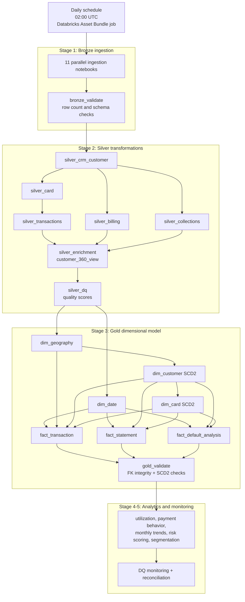

# Interview Architecture Diagram - Credit Card Defaulter Analysis

Use this version in interviews. It is intentionally smaller than the full architecture document so you can explain the project in 2-3 minutes.

## 1. One-Slide Architecture

```mermaid
flowchart LR
    subgraph Sources["Synthetic Banking Source Systems"]
        CRM["CRM<br/>customers, address"]
        Card["Card Management<br/>card details, status"]
        Txn["Transactions<br/>JSON events"]
        Billing["Billing<br/>statements, payments"]
        Collections["Collections<br/>defaults, recovery"]
        Ref["Reference Data<br/>country, state, currency, calendar"]
    end

    Landing["Unity Catalog Volume<br/>raw landing zone<br/>CSV / Parquet / JSON / Excel"]

    subgraph Bronze["Bronze - Raw Delta Tables"]
        B1["13 source tables"]
        B2["metadata columns"]
        B3["dq_quarantine + pipeline_logs"]
    end

    subgraph Silver["Silver - Cleansed and Validated"]
        S1["customer_clean"]
        S2["card_clean"]
        S3["transaction_clean"]
        S4["statement_clean / payment_clean"]
        S5["default_clean / recovery_clean"]
        S6["customer_360_view + dq_scores"]
    end

    subgraph Gold["Gold - Business Star Schema"]
        Dims["Dimensions<br/>dim_customer SCD2<br/>dim_card SCD2<br/>dim_date<br/>dim_geography"]
        Facts["Facts<br/>fact_transaction<br/>fact_statement<br/>fact_default_analysis"]
    end

    subgraph Consumption["Analytics and Consumption"]
        Analytics["Risk scoring<br/>payment behavior<br/>credit utilization<br/>customer segmentation"]
        PBI["Power BI dashboard<br/>Risk, Collections, Finance, Executive views"]
        Monitor["Monitoring<br/>DQ, SLA, reconciliation"]
    end

    CRM --> Landing
    Card --> Landing
    Txn --> Landing
    Billing --> Landing
    Collections --> Landing
    Ref --> Landing

    Landing -->|"Auto Loader for CSV/Parquet/JSON<br/>Batch MERGE for Excel/ref data"| Bronze
    Bronze -->|"dedupe, standardize, validate, enrich"| Silver
    Silver -->|"SCD2 dimensions + FK resolution"| Gold
    Gold --> Analytics
    Gold --> PBI
    Gold --> Monitor

    classDef bronze fill:#b87333,color:#fff,stroke:#7a4a20;
    classDef silver fill:#d9d9d9,color:#111,stroke:#888;
    classDef gold fill:#f2c94c,color:#111,stroke:#a77b00;
    classDef blue fill:#d9ecff,color:#111,stroke:#5b8db8;
    classDef green fill:#dff5e1,color:#111,stroke:#6aa36f;

    class Bronze,B1,B2,B3 bronze;
    class Silver,S1,S2,S3,S4,S5,S6 silver;
    class Gold,Dims,Facts gold;
    class Landing blue;
    class Analytics,PBI,Monitor green;
```



## 2. Pipeline Orchestration View



## 3. Star Schema View

```mermaid
erDiagram
    dim_customer ||--o{ fact_transaction : customer_sk
    dim_customer ||--o{ fact_statement : customer_sk
    dim_customer ||--o{ fact_default_analysis : customer_sk

    dim_card ||--o{ fact_transaction : card_sk
    dim_card ||--o{ fact_statement : card_sk
    dim_card ||--o{ fact_default_analysis : card_sk

    dim_date ||--o{ fact_transaction : date_sk
    dim_date ||--o{ fact_statement : statement_date_sk
    dim_date ||--o{ fact_default_analysis : default_date_sk

    dim_geography ||--o{ fact_transaction : geo_sk
    dim_geography ||--o{ dim_customer : geo_sk

    dim_customer {
        bigint customer_sk PK
        string customer_id NK
        int credit_score
        decimal annual_income
        bigint geo_sk FK
        date effective_date
        date expiry_date
        boolean is_current
    }

    dim_card {
        bigint card_sk PK
        string card_id NK
        bigint customer_sk FK
        decimal credit_limit
        decimal interest_rate
        string current_status
        date effective_date
        date scd_expiry_date
        boolean is_current
    }

    dim_date {
        int date_sk PK
        date full_date
        int month
        int quarter
        int year
    }

    dim_geography {
        bigint geo_sk PK
        string country_code
        string state_code
        string region
        string currency_code
    }

    fact_transaction {
        bigint txn_sk PK
        bigint customer_sk FK
        bigint card_sk FK
        int date_sk FK
        bigint geo_sk FK
        decimal amount
    }

    fact_statement {
        bigint statement_sk PK
        bigint customer_sk FK
        bigint card_sk FK
        int statement_date_sk FK
        decimal closing_balance
        decimal minimum_due
        decimal utilization_ratio
    }

    fact_default_analysis {
        bigint default_sk PK
        bigint customer_sk FK
        bigint card_sk FK
        int default_date_sk FK
        int days_past_due
        decimal outstanding_amount
        decimal recovery_amount
    }
```

## 4. Interview Talking Points

1. **Project goal:** This is an end-to-end Databricks lakehouse project for credit card default-risk analytics.
2. **Architecture:** I used a medallion architecture: Bronze for raw auditable data, Silver for cleansed validated entities, and Gold for a star schema optimized for reporting.
3. **Ingestion:** Different source formats are handled: CSV, Parquet, JSON, and Excel. Auto Loader handles scalable file ingestion, while batch MERGE is used where it fits better.
4. **Data quality:** The project includes null, duplicate, range, domain, regex, FK, and reconciliation checks. Bad records can be quarantined and DQ scores are stored for monitoring.
5. **Gold model:** Customer and card dimensions use SCD Type 2 so historical changes in credit score, income, card limit, and card status can be analyzed correctly.
6. **Business output:** The Gold facts support risk scoring, payment behavior analysis, credit utilization, default analysis, recovery tracking, and Power BI dashboards.
7. **Orchestration:** Databricks Asset Bundles define the jobs, schedules, resources, retries, and environment targets for dev/prod deployment.
8. **Engineering decisions:** Serverless Databricks does not support Spark cache/persist, so the implementation uses broadcast joins and Delta optimizations instead.

## 5. Short Explanation Script

"This project simulates a banking data platform for credit card default analysis. Raw files from CRM, card, transaction, billing, collections, and reference systems land in a Unity Catalog volume. The Bronze layer ingests them into Delta tables with metadata and auditability. The Silver layer cleans, deduplicates, validates, enriches, and creates a customer 360 view. The Gold layer converts the clean data into a star schema with SCD Type 2 customer and card dimensions, plus transaction, statement, and default fact tables. On top of that, analytics notebooks produce risk scoring, utilization, payment behavior, trends, and customer segmentation, which can be consumed by Power BI. The full flow is orchestrated using Databricks Asset Bundles with scheduled jobs, validation, retries, and monitoring."

