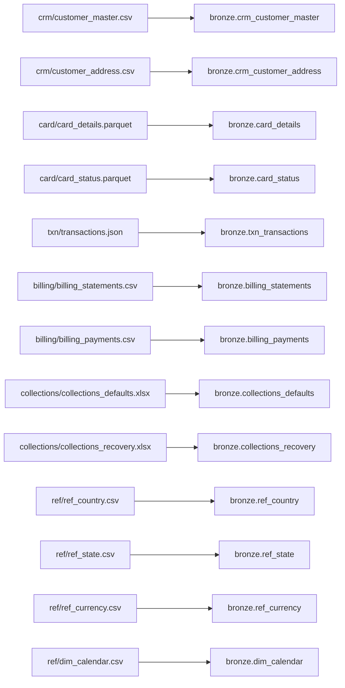
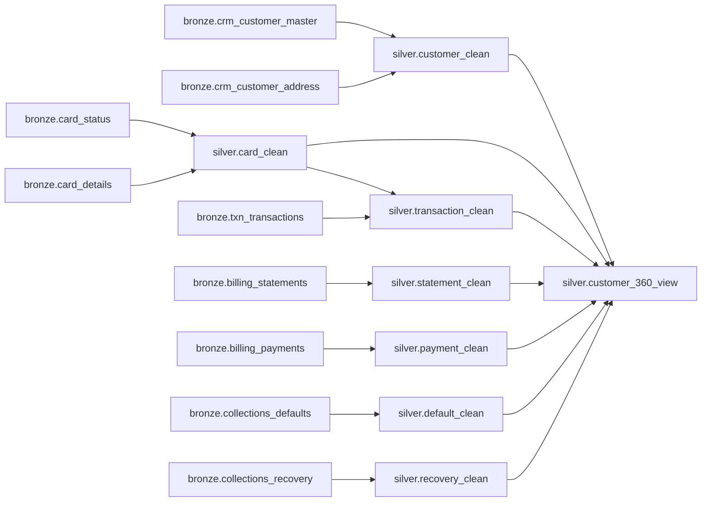
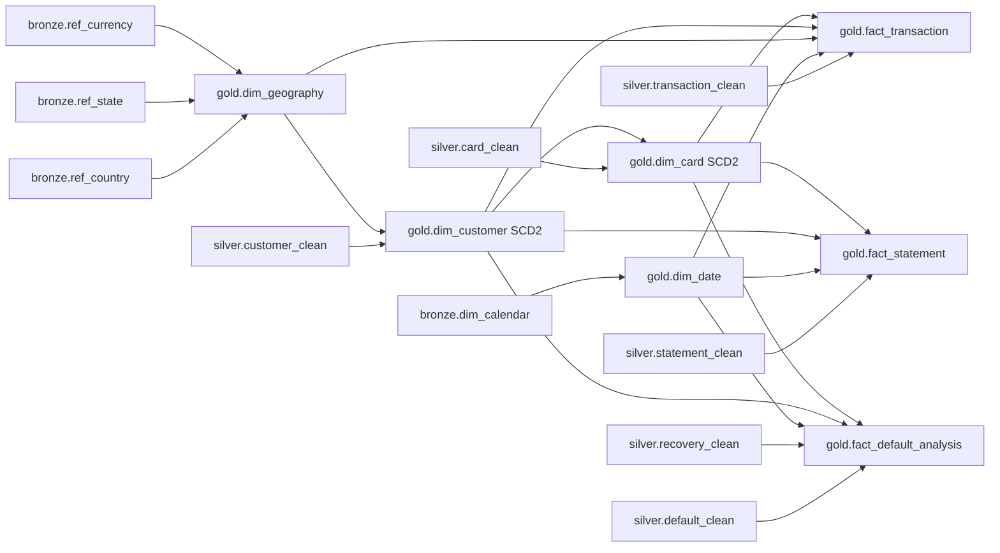
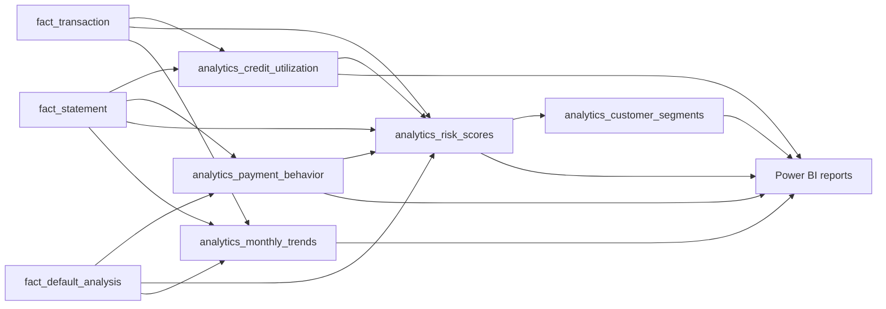

# Data Lineage

## Source to Bronze

## Bronze to Silver

## Silver to Gold

## Gold to Analytics and Power BI

## Dependency Notes

- `silver_card` depends on `silver_crm_customer` in the workflow.
- `silver_transactions` depends on `silver_card` because transactions are enriched with card/customer mapping.
- `silver_enrichment` depends on transactions, billing, and collections.
- `gold_dim_customer` depends on `gold_dim_geography`.
- `gold_dim_card` depends on `gold_dim_customer`.
- Gold facts depend on all required current dimensions.
- Monitoring depends on analytics completion in the full pipeline job.

