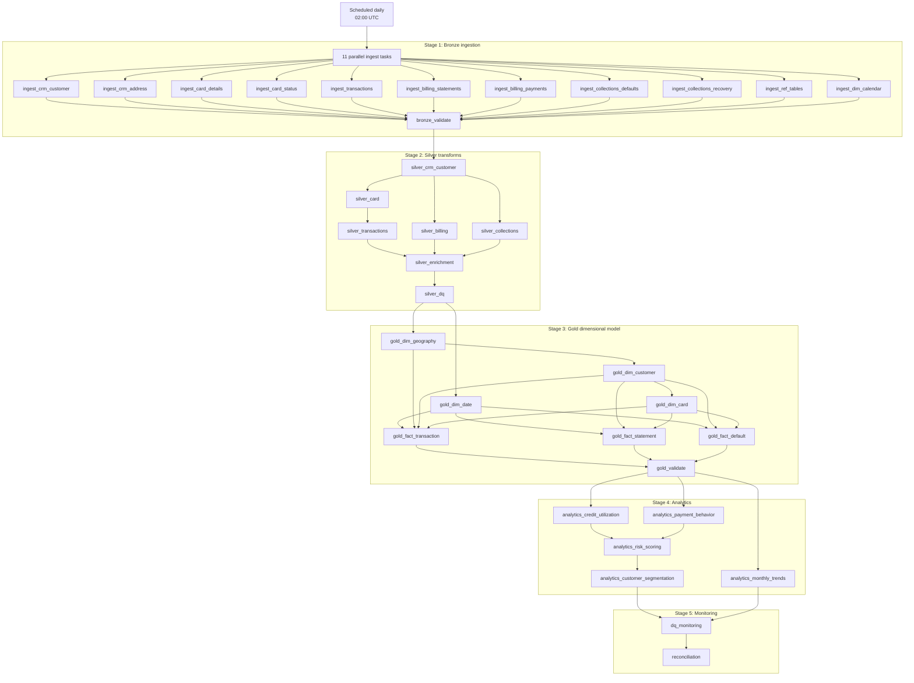

# Pipeline Flow

## Full Pipeline DAG

The full workflow is defined in `resources/full_pipeline_job.yml`.

## Execution Characteristics

| Area | Current behavior |
|---|---|
| Scheduling | Full pipeline at 02:00 UTC; monitoring job at 06:00 UTC |
| Concurrency | Full pipeline `max_concurrent_runs: 1` |
| Retries | Many workflow tasks define retries and timeout seconds |
| Bronze | Parallel ingestion followed by validation |
| Silver | Customer first, then card/transaction plus billing and collections branches |
| Gold | Date/geography first, customer/card SCD2 next, facts in parallel, then validation |
| Analytics | Utilization, payment behavior, and trends first; risk score then segmentation |
| Monitoring | DQ monitoring then reconciliation; separate monitoring job also includes SLA and maintenance |

## Current Load Patterns

| Layer | Pattern |
|---|---|
| Bronze streaming-like file ingestion | Auto Loader `availableNow=True`, Delta append, checkpoints |
| Bronze reference tables | Batch read and MERGE |
| Bronze Excel collections | pandas read, Spark DataFrame, Delta MERGE or first overwrite |
| Silver | Mostly full overwrite snapshots with CDF enabled; comments mention MERGE but code often overwrites |
| Gold dimensions | Type 1 full refresh for date/geography; SCD2 MERGE and append for customer/card |
| Gold facts | Full overwrite snapshots |
| Analytics | Full overwrite snapshots |

## Failure and Recovery

Current mechanisms:

- Workflow task retries and timeouts.
- Pipeline logger writes `STARTED`, `COMPLETED`, and `FAILED` events.
- DQ framework can quarantine failed records.
- Auto Loader checkpoints support restart.
- Bronze runner can reset checkpoints when explicitly run.

Recommended additions:

- Parameterized backfill date range.
- Controlled checkpoint reset procedure.
- Per-table watermark integration.
- Dead-letter dashboard for quarantine review.
- Automated rollback/replay playbooks.
- GitHub Actions promotion gates.

